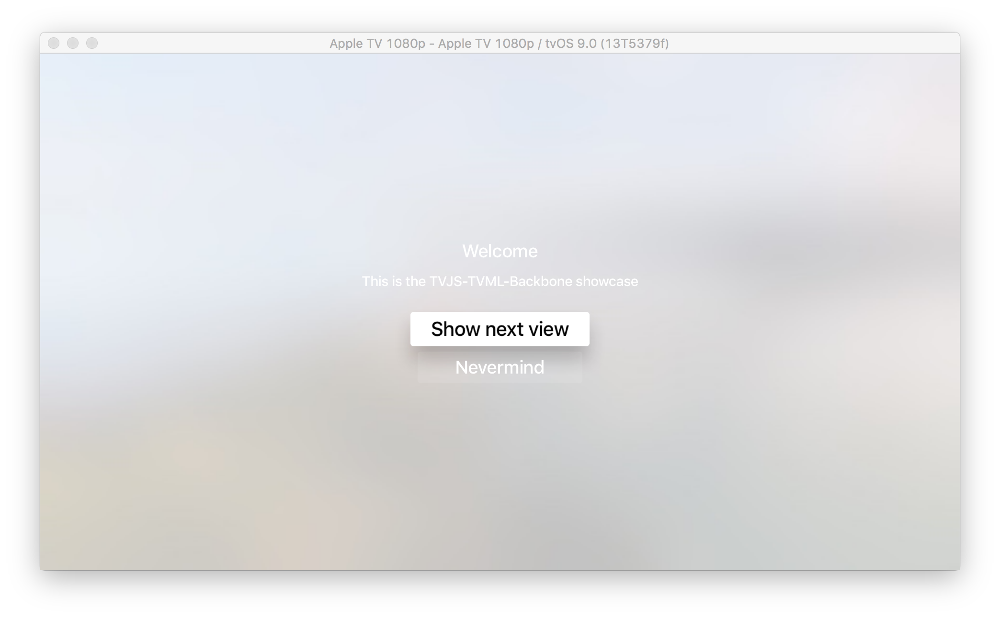
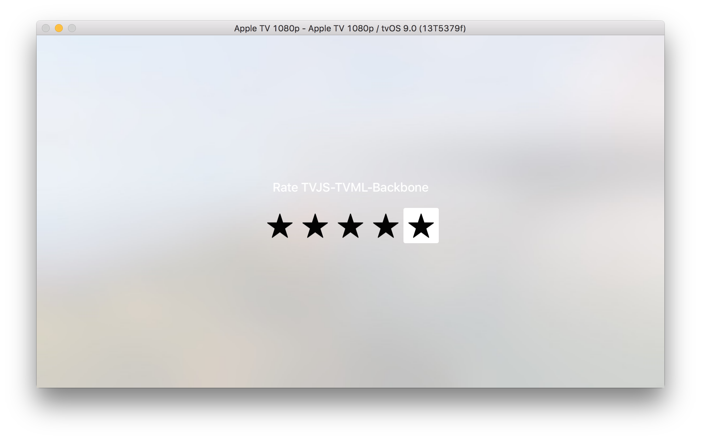

# TVJS-TVML-Backbone
Backbone bindings to Apple's [TVJS and TVML](https://developer.apple.com/library/prerelease/tvos/navigation/)

## This is still just a proof of concept


# Concept

The Router is used for navigation, so the concept of URL's can be used to navigate in the TVML app. 

Views have a `show` and a `replace` call, corresponding to the `navigationDocument.pushDocument` and `navigationDocument.replaceDocument`.

#Example 





See `example.js` or below:

```
var TVJS = require('./tvjs-tvml-backbone');
var _ = require('underscore');


// create router bindings
var Router = TVJS.Router.extend({
  routes: {
    "start":    "start",
    "second":   "second"
  },

  start: function(query, page) {
    var startView = new StartView();
    startView.show();
  },

  second: function(query, page) {
    var secondView = new SecondView();
    secondView.show();
  }

});

// create a view with events
var StartView = TVJS.View.extend({

  events: {
    "select #show-next": "onSelectShowNext"
  },

  template: _.template("<document>\
   <alertTemplate>\
      <title>Welcome</title>\
      <description>This is the TVJS-TVML-Backbone showcase</description>\
      <button id='show-next'>\
         <text>Show next view</text>\
      </button>\
      <button>\
         <text>Nevermind</text>\
      </button>\
   </alertTemplate>\
</document>"),


  initialize: function(){
    this.document = this.parseTemplateString(this.template());
  },

  onSelectShowNext: function(){
    myRouter.navigate("second");
  }

});

var SecondView = TVJS.View.extend({
  template: _.template("<document>\
   <ratingTemplate>\
      <title>Rate TVJS-TVML-Backbone</title>\
      <ratingBadge value=\"1\"></ratingBadge>\
   </ratingTemplate>\
</document>"),

  initialize: function(){
     this.document = this.parseTemplateString(this.template());
  }

});

var myRouter = new Router();

App.onLaunch = function(options) {
  myRouter.navigate("start");
}

App.onExit = function() {
    console.log('App finished');
}
```

## Todo

 * Clean up code
 * Add tests
 * Template testing with fall back to on screen error page
 * Lots of other stuff, pull requests much appreciated